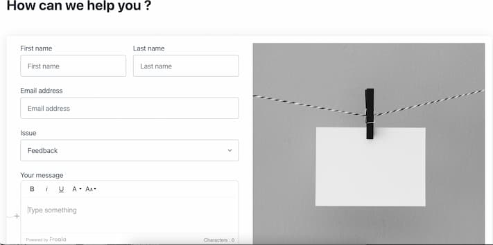

# PHP Simple Web Form

## Demo

[Live Demo on heroku](https://php02-webform.herokuapp.com/)

## Description

This Project is suggested by [codementor.io](https://www.codementor.io/projects/web/create-a-contact-form-b2n9ltrdy1)
This is the second project I build while learning PHP.

## Requirements

The form should consist of:

-   A text input for user’s name
-   A text input for user’s email address
-   A drop down to select user’s issue (Query, Feedback, Complaint, Other)
-   A text area for user’s comment
-   The form will post to a second page which will display the information in an easy to read format.
-   There are more optional conditions to add challenge and/or better functionality to your form below

### Extra challenge:

-   Make the text area a WYSIWYG. (Use Summernote or CKEditor for example).
-   Add an edit button to the second page, send the data back to the form, and autofill the data back into the fields.
-   If you would like to practice more with databases, add a submit button on the second page which will save the response to a database table.

## Made with...

-   [Pico.css](https://picocss.com/) - Framework CSS (front-end)
-   [Froala](https://froala.com/wysiwyg-editor/) - WYSIWYG text editor
-   [Unsplash](https://unsplash.com/) - Illustrations
        [Bojan Dubov ](https://unsplash.com/@bojandubov?utm_source=unsplash&utm_medium=referral&utm_content=creditCopyText)
  
